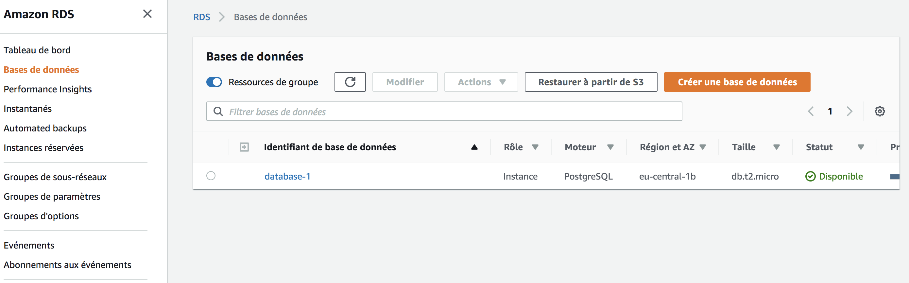
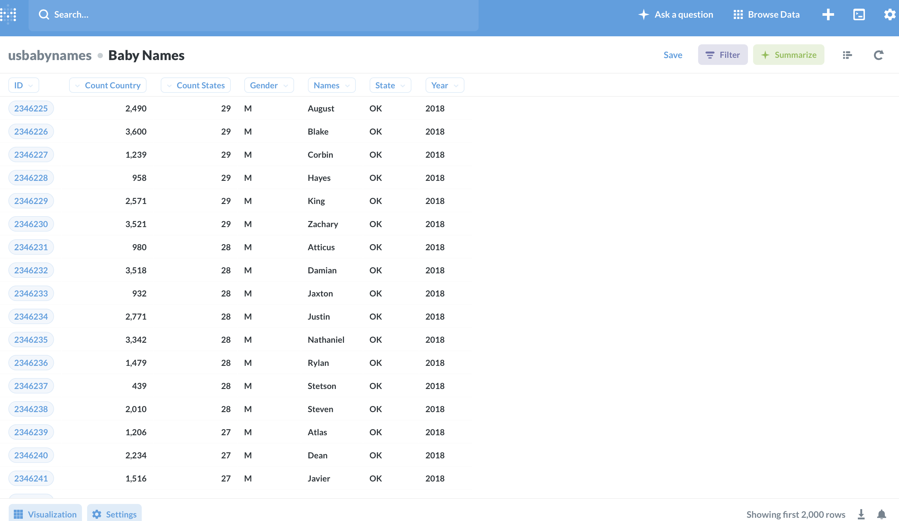
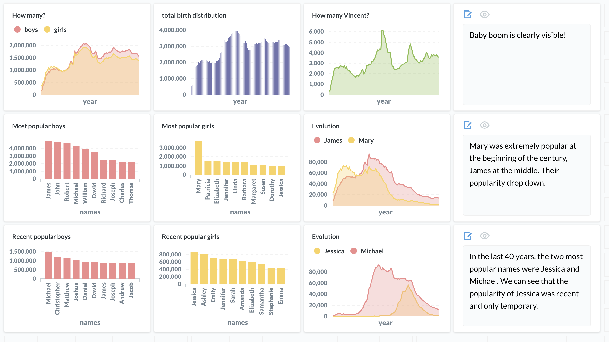

# Dashboard
---
>
>
## Introduction

This project aims at creating a Postgres database, host it in AWS RDS (Amazon Relational Database Service), and deploy it in a Metabase interface accessible from a web browser through AWS EC2 (Amazon Elastic Compute Cloud ).
The dataset I will be using is the baby names dataset available at:

[https://www.ssa.gov/oact/babynames/limits.html](https://www.ssa.gov/oact/babynames/limits.html).  

It contains the baby names of U.S. births between 1910 and 2018, per state, for a total of more than 6 millions rows. The process can easily be adapted for any other structured dataset.

## Create a Postgres database

The dataset can be downloaded at [State-specific data](https://www.ssa.gov/oact/babynames/state/namesbystate.zip) and has a size of (21Mb).

To create the database, PostGreSQL needs to be installed on your computer.

Then, two options are available:

- Option 1 (from text files):

Run in the terminal `python prepare_database_csv.py`
which will create a csv files with initial data and an additional
count of births per country (on top of the count per states on the downloaded dataset).

Then, `createdb usbabynames_db`
which will create the Postgres database.

Connect to this databse with `psql -d usbabynames_db`

Then you can type the SQL query to initialize the table:

```
CREATE TABLE babynames (
id SERIAL PRIMARY KEY,
state VARCHAR(20),
gender VARCHAR(1),
year INTEGER,
names VARCHAR(20),
count_states INTEGER,
count_country INTEGER
);
```

You can then fill the table using the csv file previously created:

`COPY babynames FROM 'babynames_db.csv' DELIMITER ',';`

(ctrl + d to exit)

- Option 2 (with sqlalchemy):

This option requires to have installed `sqlalchemy` and `psycopg2` .

In the terminal type: `createdb usbabynames_db`

Then `python prepare_database_sqlalchemy.py`

Whether you choose option 1 or option 2, you now have a Postgres
database on your computer containing all US baby names, with 6028151 rows and 7 columns.

Now create a backup sql file of your local PostGreSQL database:
`pg_dump usbabynames_db > usbabies.sql`

It will be useful to send it on AWS RDS.

## Your database in AWS RDS

This section requires to have an AWS account.

In AWS you can create a new database, following step by step instructions: [AWS RDS instructions](https://aws.amazon.com/fr/getting-started/tutorials/create-connect-postgresql-db/).

I personally used the free tier version. From the default options, you would need to change to publicly available. Then once created, you
can go to security group and allow entrance for your IP address.

In your AWS RDS console, the status of your database should appear available.



Save the host info and the password for later use.

Then you can connect to this database from your local computer (replace youramazonhost by the info you received at the database creation):

`psql -h youramazonhost -p 5432 -U postgres -d postgres`  

You will be asked for your password.

Then you are connected to your AWS RDS server, you can create your database with this SQL query:

`CREATE DATABASE usbabynames;`

You can now exit.

Then, from your local computer, you can transfer the data  to AWS RDS database.

`psql -f usbabies.sql -h youramazonhost -p 5432 -U postgres -d usbabynames`

Now, you should have your postgres database hosted on AWS RDS server.


## Deploy your database in Metabase accessible from web browser

Now, to access it through a web browser, you would need to create a AWS EC2 (Amazon Elastic Compute Cloud ) instance.

You can follow step by step instructions [AWS EC2 instructions](https://docs.aws.amazon.com/fr_fr/efs/latest/ug/gs-step-one-create-ec2-resources.html)

I personally used free tier version with linux operating system.

When it is ready, it should be with state running(cf below).

Don't forget to save your secret key file in your personal folder (mykeypair.pem).
Keep as well the DNS address (youramazonDNSaddress) you will need to connect from your computer.

Make sure your AWS instance is configured to accept any inbound traffic on port 80 (HTTP).
In your AWS dashboard, scroll over to Security Groups > launch wizard > click on the Inbound tab > Edit > Add Rule > add HTTP (default Port 80)


Now you can connect to your EC2 instance from your terminal using ssh.

To simplify the installation on your EC2 instance, copy the `installation.sh` file i made into your EC2 instance:

`scp -i mykeypair.pem installation.sh ec2-user@youramazonDNSaddress:.`  

Then you can connect to your EC2 instance via ssh:

`ssh -i mykeypair.pem ec2-user@youramazonDNSaddress`

Your are now on your new EC2 instance with nothing installed.
You would need to download metabase.jar, install the Java

Development Kit (JDK), launch the Metabase server, and install nginx (web server that we will
use to redirect the default metabase port (:3000) to the public HTTP port (:80).

To do so:

give execution right to installation.sh:

`chmod u+x installation.sh`

Run: `./installation.sh`   

Follow the installation on the terminal. After some time, a nano editor will be opened.

In the nano editor: locate the server section.
Comment (using the # symbol) the line that starts with root and the line
that starts with include .

Also, edit the location section as follows:

`location / { proxy_pass http://127.0.0.1:3000/; }`      

Then save.

Then restart nginx: `sudo service nginx restart`

`cd`

Then you can launch your metabase server accessible in the browser:

`java -jar metabase.jar`

On any web browser (e.g. Chrome), visit the URL of your EC2 instance and you should see the Metabase application running!
e.g. http://youramazonDNSaddress

## Metabase

On your http://youramazonDNSaddress you can connect Metabase to your AWS RDS database by specifying the database informations at the start.

You can now access your database in Metabase:



&nbsp;&nbsp;&nbsp;

Then on Metabase, you can play with your dataset and make SQL queries, ask questions, create display, create dashboard than you can share with your team (give access through the admin option to other people and they can access from their browser).

Here is an example of a simple SQL query:


&nbsp;&nbsp;&nbsp;

You can create a dashboard with interactive plots and text. An example below:

&nbsp;&nbsp;&nbsp;



&nbsp;&nbsp;&nbsp;


Note:
At the end of your use, delete the AWS RDS and AWS EC2 if you do not want to pay (free tier ends after some time).
You can install and use metabase directly locally on your computer (it will not require AWS RDS and AWS EC2), but it will not be available from the browser.


## License

[](http://badges.mit-license.org)

- **[MIT license](http://opensource.org/licenses/mit-license.php)**
